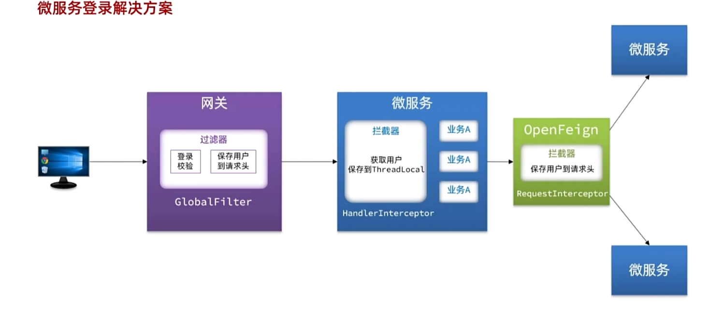

# SpringCloud

## 远程调用

1.注入RestTemplate到Spring容器之中

~~~java
@Bean
public RestTemplate restTemplate(){
     return new RestTemplate();
 }
~~~

2.发起远程调用

~~~java
// 2.1利用RestTemplate发起http的请求
ResponseEntity<List<ItemDTO>> response = restTemplate.exchange(
        "http://localhost:8081/items?ids={ids}",
        HttpMethod.GET,
        null,
        new ParameterizedTypeReference<List<ItemDTO>>() {
        },
        Map.of("ids", CollUtils.join(itemIds, ","))
);
//2.2解析响应
if(!response.getStatusCode().is2xxSuccessful()){
    //查询失败，直接结束
    return;
}
List<ItemDTO> items = response.getBody();
~~~

但是由于被远程调用的哪个模块可能会被部署到多个服务器上，这样RestTemplate的方式就不能够负载均衡的去调用，因此我们需要新的组件来实现这个功能

## 服务治理

### 注册中心原理

模块会给注册中心发送心跳请求来续约如果不发送心跳请求那么注册中心会认为该模块已经挂了，然后注册中心会给发送请求的模块推送请求变更

服务治理的三个角色：服务提供者、服务消费者、注册中心

消费者如何知道提供者的地址：服务提供者会在启动的时候注册到注册中心，消费者可以从注册中心订阅和拉取服务信息

消费者如何得知服务状态变更:服务提供者通过心跳请求想注册中心报告自己的情况，当心跳异常时，注册中心会将该实例从自己的注册中心剔除并通知服务消费者

当提供者有多个实例的时候，消费者该选择哪一个:通过负载均衡算法来选择

### Nacos注册中心

Docker配置nacos

0.创建一个nacos的数据库

1.配置custom.env

~~~env
PREFER_HOST_MODE=hostname
MODE=standalone
SPRING_DATASOURCE_PLATFORM=mysql
MYSQL_SERVICE_HOST=192.168.85.131
MYSQL_SERVICE_DB_NAME=nacos
MYSQL_SERVICE_PORT=3306
MYSQL_SERVICE_USER=root
MYSQL_SERVICE_PASSWORD=123
MYSQL_SERVICE_DB_PARAM=characterEncoding=utf8&connectTimeout=1000&socketTimeout=3000&autoReconnect=true&useSSL=false&allowPublicKeyRetrieval=true&serverTimezone=Asia/Shanghai
~~~

2.将该文件传入docker的根目录下

3.进入根目录执行下面Docker命令

~~~bash
docker run -d \
--name nacos \
--env-file ./nacos/custom.env \
-p 8848:8848 \
-p 9848:9848 \
-p 9849:9849 \
--restart=always \
nacos/nacos-server:v2.1.0-slim
~~~

### 服务注册

1.引入Nacos依赖

~~~xml
<!--nacos 服务注册发现-->
<dependency>
    <groupId>com.alibaba.cloud</groupId>
    <artifactId>spring-cloud-starter-alibaba-nacos-discovery</artifactId>
</dependency>
~~~

2.在application.yaml中配置Nacos

~~~yaml
spring:
  application:
    name: item-service # 服务名称
  cloud:
    nacos:
      server-addr: 192.168.85.131:8848 # nacos地址
~~~

### 服务发现

1.引入nacos discovery的依赖

~~~xml
<!--nacos 服务注册发现-->
<dependency>
    <groupId>com.alibaba.cloud</groupId>
    <artifactId>spring-cloud-starter-alibaba-nacos-discovery</artifactId>
</dependency>
~~~

可以发现，这里Nacos的依赖于服务注册时一致，这个依赖中同时包含了服务注册和发现的功能。因为任何一个微服务都可以调用别人，也可以被别人调用，即可以是调用者，也可以是提供者。

2.配置nacos的地址

```YAML
spring:
  cloud:
    nacos:
      server-addr: 192.168.150.101:8848
```

3.服务发现

接下来，服务调用者`cart-service`就可以去订阅`item-service`服务了。不过item-service有多个实例，而真正发起调用时只需要知道一个实例的地址。

因此，服务调用者必须利用负载均衡的算法，从多个实例中挑选一个去访问。常见的负载均衡算法有：

- 随机
- 轮询
- IP的hash
- 最近最少访问
- ...

这里我们可以选择最简单的随机负载均衡。

~~~java
//2.1根据服务名称获取服务的实例列表
List<ServiceInstance> instances = discoveryClient.getInstances("item-service");
if(CollUtils.isEmpty(instances)){
    return;
}
//2.2手写负载均衡
ServiceInstance instance = instances.get(RandomUtil.randomInt(instances.size()));

// 2.1利用RestTemplate发起http的请求
ResponseEntity<List<ItemDTO>> response = restTemplate.exchange(
        instance.getUri() + "/items?ids={ids}",
        HttpMethod.GET,
        null,
        new ParameterizedTypeReference<List<ItemDTO>>() {
        },
        Map.of("ids", CollUtils.join(itemIds, ","))
);
//2.2解析响应
if(!response.getStatusCode().is2xxSuccessful()){
    //查询失败，直接结束
    return;
}

List<ItemDTO> items = response.getBody();
~~~

## OpenFeign

### 快速入门

基于SpringMVC的常见注解，帮我们优雅的实现http的请求的发送

1.引入依赖 包括OpenFeign和负载均衡组件SpringCloudLoadBalancer

~~~xml
  <!--openFeign-->
  <dependency>
      <groupId>org.springframework.cloud</groupId>
      <artifactId>spring-cloud-starter-openfeign</artifactId>
  </dependency>
  <!--负载均衡器-->
  <dependency>
      <groupId>org.springframework.cloud</groupId>
      <artifactId>spring-cloud-starter-loadbalancer</artifactId>
  </dependency>
~~~

2.通过@EnableFeignClients注解 启用OpenFeign功能

3.编写OpenFeign客户端

~~~java
package com.hmall.cart.client;

import com.hmall.cart.domain.dto.ItemDTO;
import org.springframework.cloud.openfeign.FeignClient;
import org.springframework.web.bind.annotation.GetMapping;
import org.springframework.web.bind.annotation.RequestParam;

import java.util.List;

@FeignClient("item-service")
public interface ItemClient {

    @GetMapping("/items")
    List<ItemDTO> queryItemByIds(@RequestParam("ids") Collection<Long> ids);
}
~~~

这里只需要声明接口，无需实现方法。接口中的几个关键信息：

- `@FeignClient("item-service")` ：声明服务名称
- `@GetMapping` ：声明请求方式
- `@GetMapping("/items")` ：声明请求路径
- `@RequestParam("ids") Collection<Long> ids` ：声明请求参数
- `List<ItemDTO>` ：返回值类型

在使用 **OpenFeign** 客户端时，**函数名可以与远程服务的接口方法名不一致**。实际上，OpenFeign 主要通过 HTTP 请求的方法和路径来确定要调用的服务接口，而不是通过函数名。因此，你可以根据自己的需要命名客户端中的方法，只要其他注解或配置正确即可。

~~~java
List<ItemDTO> items = itemClient.queryItemByIds(itemIds);  //一行语句就可以调用
~~~

### 连接池

OpenFeign对http请求做了优雅的伪装，不过其底层发起http请求，依赖于其他的框架。这些框架可以自由的选择，包括以下三种：

1.HttpURLConnection:默认实现，不支持连接池

2.Apache HttpClient:支持连接池

3.OKHttp:支持连接池

OpenFeign整合OKHttp的步骤如下

1.引入依赖

~~~xml
<!--OK http 的依赖 -->
<dependency>
  <groupId>io.github.openfeign</groupId>
  <artifactId>feign-okhttp</artifactId>
</dependency>
~~~


2.开启连接池功能

~~~yaml
feign:
  okhttp:
    enabled: true # 开启OKHttp功能
~~~

### 最佳实践

为了避免在每一个模块中都去写OpenFeign的接口，有以下两种解决方法

1.抽取微服务之外的公共module

2.每个微服务都抽取一个module

方案1抽取更加简单，工程结构也比较清晰，但缺点是整个项目耦合度偏高。

方案2抽取相对麻烦，工程结构相对更复杂，但服务之间耦合度降低。


现在由于@EnableFeignClients在hm-cart这个模块的启动类上,扫描不到ItemClient会导致报错

有以下两种方法：

1.声明式扫描包 

~~~java
@EnableFeignClients(basePackages = "com.hmall.api.client")
~~~

2.声明要用到的FeignClient

~~~java
@EnableFeignClients(clients = {ItemClient.class})
~~~

### 日志

OpenFeign只会在FeignClient所在包的日志级别为**DEBUG**时，才会输出日志。而且其日志级别有4级：

- **NONE**：不记录任何日志信息，这是默认值。
- **BASIC**：仅记录请求的方法，URL以及响应状态码和执行时间
- **HEADERS**：在BASIC的基础上，额外记录了请求和响应的头信息
- **FULL**：记录所有请求和响应的明细，包括头信息、请求体、元数据。

Feign默认的日志级别就是NONE，所以默认我们看不到请求日志。

1.新建一个配置类来定义Feign的日志级别

```java
@Configuration
public class DefaultFeignConfig {
    @Bean
    public Logger.Level feignLogLevel(){
        return Logger.Level.FULL;
    }
}
```

2.配置使得这个配置类生效

- **局部**生效：在某个`FeignClient`中配置，只对当前`FeignClient`生效

```Java
@FeignClient(value = "item-service", configuration = DefaultFeignConfig.class)
```

- **全局**生效：在`@EnableFeignClients`中配置，针对所有`FeignClient`生效。

```Java
@EnableFeignClients(defaultConfiguration = DefaultFeignConfig.class)
```

## 路由

### 网关路由

#### 认识路由

顾明思议，网关就是**网**络的**关**口。数据在网络间传输，从一个网络传输到另一网络时就需要经过网关来做数据的**路由** **和转发以及数据安全的校验**。

现在，微服务网关就起到同样的作用。前端请求不能直接访问微服务，而是要请求网关：

- 网关可以做安全控制，也就是登录身份校验，校验通过才放行
- 通过认证后，网关再根据请求判断应该访问哪个微服务，将请求转发过去

#### 快速入门

接下来，我们先看下如何利用网关实现请求路由。由于网关本身也是一个独立的微服务，因此也需要创建一个模块开发功能。大概步骤如下：

1.创建网关微服务

2.引入SpringCloudGateway、NacosDiscovery依赖

~~~xml
 <!--网关-->
        <dependency>
            <groupId>org.springframework.cloud</groupId>
            <artifactId>spring-cloud-starter-gateway</artifactId>
        </dependency>
        <!--nacos discovery-->
        <dependency>
            <groupId>com.alibaba.cloud</groupId>
            <artifactId>spring-cloud-starter-alibaba-nacos-discovery</artifactId>
        </dependency>
        <!--负载均衡-->
        <dependency>
            <groupId>org.springframework.cloud</groupId>
            <artifactId>spring-cloud-starter-loadbalancer</artifactId>
        </dependency>
~~~

3.编写启动类

4.配置网关路由

~~~yaml
server:
  port: 8080
spring:
  application:
    name: gateway
  cloud:
    nacos:
      server-addr: 192.168.150.101:8848
    gateway:
      routes:
        - id: item # 路由规则id，自定义，唯一
          uri: lb://item-service # 路由的目标服务，lb代表负载均衡，会从注册中心拉取服务列表
          predicates: # 路由断言，判断当前请求是否符合当前规则，符合则路由到目标服务
            - Path=/items/**,/search/** # 这里是以请求路径作为判断规则
        - id: cart
          uri: lb://cart-service
          predicates:
            - Path=/carts/**
        - id: user
          uri: lb://user-service
          predicates:
            - Path=/users/**,/addresses/**
        - id: trade
          uri: lb://trade-service
          predicates:
            - Path=/orders/**
        - id: pay
          uri: lb://pay-service
          predicates:
            - Path=/pay-orders/**
~~~

四个属性含义如下：

- `id`：路由的唯一标示
- `predicates`：路由断言，其实就是匹配条件
- `filters`：路由过滤条件，后面讲
- `uri`：路由目标地址，`lb://`代表负载均衡，从注册中心获取目标微服务的实例列表，并且负载均衡选择一个访问。

这里我们重点关注`predicates`，也就是路由断言。SpringCloudGateway中支持的断言类型有很多：

| **名称**   | **说明**                       | **示例**                                                     |
| :--------- | :----------------------------- | :----------------------------------------------------------- |
| After      | 是某个时间点后的请求           | - After=2037-01-20T17:42:47.789-07:00[America/Denver]        |
| Before     | 是某个时间点之前的请求         | - Before=2031-04-13T15:14:47.433+08:00[Asia/Shanghai]        |
| Between    | 是某两个时间点之前的请求       | - Between=2037-01-20T17:42:47.789-07:00[America/Denver], 2037-01-21T17:42:47.789-07:00[America/Denver] |
| Cookie     | 请求必须包含某些cookie         | - Cookie=chocolate, ch.p                                     |
| Header     | 请求必须包含某些header         | - Header=X-Request-Id, \d+                                   |
| Host       | 请求必须是访问某个host（域名） | - Host=**.somehost.org,**.anotherhost.org                    |
| Method     | 请求方式必须是指定方式         | - Method=GET,POST                                            |
| Path       | 请求路径必须符合指定规则       | - Path=/red/{segment},/blue/**                               |
| Query      | 请求参数必须包含指定参数       | - Query=name, Jack或者- Query=name                           |
| RemoteAddr | 请求者的ip必须是指定范围       | - RemoteAddr=192.168.1.1/24                                  |
| weight     | 权重处理                       |                                                              |

### 网关登录校验

#### 鉴权思路分析

现有的鉴权主要是jwt来完成的，现在项目被拆分成多个微服务，在每个模块中写jwt是不太现实，代码重复性也是非常高的。既然网关是所有微服务的入口，我们可以把登录校验放到网关这个模块上。

以下主要解决这几个问题：

- 网关路由是配置的，请求转发是Gateway内部代码，我们如何在转发之前做登录校验？
- 网关校验JWT之后，如何将用户信息传递给微服务？
- 微服务之间也会相互调用，这种调用不经过网关，又该如何传递用户信息？

#### 网关过滤器

1. 客户端请求进入网关后由`HandlerMapping`对请求做判断，找到与当前请求匹配的路由规则（**`Route`**），然后将请求交给`WebHandler`去处理。
2. `WebHandler`则会加载当前路由下需要执行的过滤器链（**`Filter chain`**），然后按照顺序逐一执行过滤器（后面称为**`Filter`**）。
3. 图中`Filter`被虚线分为左右两部分，是因为`Filter`内部的逻辑分为`pre`和`post`两部分，分别会在请求路由到微服务**之前**和**之后**被执行。
4. 只有所有`Filter`的`pre`逻辑都依次顺序执行通过后，请求才会被路由到微服务。
5. 微服务返回结果后，再倒序执行`Filter`的`post`逻辑。
6. 最终把响应结果返回。

网关过滤器链中的过滤器有两种：

- **`GatewayFilter`**：路由过滤器，作用范围比较灵活，可以是任意指定的路由`Route`. 

  ~~~java
  @Component
  public class PrintAnyGatewayFilterFactory extends AbstractGatewayFilterFactory<Object> {
      @Override
      public GatewayFilter apply(Object config) {
          return new GatewayFilter() {
              @Override
              public Mono<Void> filter(ServerWebExchange exchange, GatewayFilterChain chain) {
                  // 获取请求
                  ServerHttpRequest request = exchange.getRequest();
                  // 编写过滤器逻辑
                  System.out.println("过滤器执行了");
                  // 放行
                  return chain.filter(exchange);
              }
          };
      }
  }
  ~~~

  

- **`GlobalFilter`**：全局过滤器，作用范围是所有路由，不可配置。

  ~~~java
  /**
  	PrintAnyGlobalFilter这个类名的后缀是固定的 为了方便再配置 PrintAny
  */
  @Component
  public class PrintAnyGlobalFilter implements GlobalFilter, Ordered {
      @Override
      public Mono<Void> filter(ServerWebExchange exchange, GatewayFilterChain chain) {
          // 编写过滤器逻辑
          System.out.println("未登录，无法访问");
          // 放行
          // return chain.filter(exchange);
  
          // 拦截
          ServerHttpResponse response = exchange.getResponse();
          response.setRawStatusCode(401);
          return response.setComplete();
      }
  
      @Override
      public int getOrder() {
          // 过滤器执行顺序，值越小，优先级越高
          return 0;
      }
  }
  ~~~

  #### 

  #### 网关登录校验

  1.配置jwt工具及其文件

  2.登录校验过滤器

  ~~~java
  @Component
  @RequiredArgsConstructor
  @EnableConfigurationProperties(AuthProperties.class)
  public class AuthGlobalFilter implements GlobalFilter, Ordered {
  
      private final JwtTool jwtTool;
  
      private final AuthProperties authProperties;
  
      private final AntPathMatcher antPathMatcher = new AntPathMatcher();
  
      @Override
      public Mono<Void> filter(ServerWebExchange exchange, GatewayFilterChain chain) {
          // 1.获取Request
          ServerHttpRequest request = exchange.getRequest();
          // 2.判断是否不需要拦截
          if(isExclude(request.getPath().toString())){
              // 无需拦截，直接放行
              return chain.filter(exchange);
          }
          // 3.获取请求头中的token
          String token = null;
          List<String> headers = request.getHeaders().get("authorization");
          if (!CollUtils.isEmpty(headers)) {
              token = headers.get(0);
          }
          // 4.校验并解析token
          Long userId = null;
          try {
              userId = jwtTool.parseToken(token);
          } catch (UnauthorizedException e) {
              // 如果无效，拦截
              ServerHttpResponse response = exchange.getResponse();
              response.setRawStatusCode(401);
              return response.setComplete();
          }
  
          // TODO 5.如果有效，传递用户信息
          System.out.println("userId = " + userId);
          // 6.放行
          return chain.filter(exchange);
      }
  
      private boolean isExclude(String antPath) {
          for (String pathPattern : authProperties.getExcludePaths()) {
              if(antPathMatcher.match(pathPattern, antPath)){
                  return true;
              }
          }
          return false;
      }
  
      @Override
      public int getOrder() {
          return 0;
      }
  }
  ~~~

  

  ####  微服务获取用户

  0.前置知识

  ### 1. **什么是 `ThreadLocal`？**

  `ThreadLocal` 是 Java 提供的一个工具类，用于为每个线程存储独立的数据副本。每个线程对 `ThreadLocal` 的访问是线程私有的，也就是说，线程之间的数据不会相互干扰。常见的使用场景是存储线程级别的数据，比如用户会话、事务管理等。

  `ThreadLocal` 的关键作用是为每个线程创建独立的变量副本，从而避免线程安全问题。

  #### `ThreadLocal`的工作原理：

  - 每个线程都有一个独立的 `ThreadLocalMap`，它存储了该线程与 `ThreadLocal` 变量之间的映射关系。
  - 当一个线程通过 `get()` 方法访问 `ThreadLocal` 变量时，实际是从这个映射中获取它的专属副本。
  - 类似的，通过 `set()` 方法设置的值仅对当前线程有效，其他线程不会受到影响。

  ### 2. **为什么网关将用户信息存入请求头？**

  在微服务架构中，网关通常是接收外部请求的第一个服务，它通常负责处理认证和授权等安全问题。在网关中，将用户信息（如用户ID或Token）存入请求头是为了在不同的微服务间传递用户信息。这样，后续的微服务可以通过解析请求头，获取并验证用户身份，而不需要每个微服务都重复执行认证逻辑。

  常见流程：

  1. 用户请求首先到达网关，网关验证用户身份（比如JWT Token）。
  2. 验证通过后，网关将用户信息（比如用户ID或Token）写入请求头，并将请求转发给下游的微服务。
  3. 下游微服务根据请求头中的用户信息执行相应的逻辑。

  ### 3. **拦截器如何使用 `ThreadLocal` 存储用户信息？**

  在微服务的拦截器中，通常会读取网关传递的请求头中的用户信息，并将这些信息存入 `ThreadLocal`，从而在同一线程中下游的所有代码都可以通过 `ThreadLocal` 访问该用户信息。这是因为：

  - `ThreadLocal` 保证了在同一个线程内的所有方法调用共享相同的 `ThreadLocal` 变量，而不同的线程彼此隔离。
  - 每次请求都会启动一个新的线程来处理，因此每个请求都可以有自己独立的 `ThreadLocal` 存储空间。

  ### 4. **为什么往下调用的微服务都能获取到 `ThreadLocal` 中的用户信息？**

  这是因为在同一个线程中，所有的处理逻辑共享同一个 `ThreadLocal` 变量。具体过程如下：

  1. **请求进入微服务时**：拦截器会获取请求头中的用户信息，将其存入当前线程的 `ThreadLocal` 中。
  2. **后续的处理逻辑**：无论是控制器、服务层还是DAO层，只要在同一个线程中执行，都可以通过 `ThreadLocal` 访问该线程存储的用户信息。
  3. **请求处理结束时**：通常在响应结束时，拦截器会清除 `ThreadLocal` 中存储的数据，防止内存泄漏。

  这样，整个请求处理流程中的所有代码（在同一线程中）都能访问到 `ThreadLocal` 中存储的用户信息，而无需显式传递这些信息。

  ### 5. **典型使用场景：**

  - **用户会话管理**：每个请求有一个独立的用户会话，`ThreadLocal` 用于存储当前线程的用户会话信息。
  - **数据库事务管理**：通过 `ThreadLocal` 存储事务对象，在同一线程中实现事务的统一管理。
  - **日志上下文信息**：在一个请求的生命周期内，记录与当前请求相关的日志上下文信息，比如用户ID等。

  1.在网关的登录校验过滤器中，把获取到的用户写入请求头。

~~~java
@Override
    public Mono<Void> filter(ServerWebExchange exchange, GatewayFilterChain chain) {

        System.out.println("进入网关拦截器！！");
        // 1.获取Request
        ServerHttpRequest request = exchange.getRequest();
        // 2.判断是否不需要拦截
        if(isExclude(request.getPath().toString())){
            // 无需拦截，直接放行
            return chain.filter(exchange);
        }
        // 3.获取请求头中的token
        String token = null;
        List<String> headers = request.getHeaders().get("authorization");
        if (!CollUtils.isEmpty(headers)) {
            token = headers.get(0);
        }
        // 4.校验并解析token
        Long userId = null;
        try {
            userId = jwtTool.parseToken(token);
        } catch (UnauthorizedException e) {
            // 如果无效，拦截
            ServerHttpResponse response = exchange.getResponse();
            response.setRawStatusCode(401);
            return response.setComplete();
        }

        // TODO 5.如果有效，传递用户信息
        String userInfo = userId.toString();
        ServerWebExchange swe = exchange.mutate()
                .request(builder -> builder.header("user-info", userInfo))
                .build();

        System.out.println("userId = " + userId);
        // 6.放行
        return chain.filter(swe);
    }
~~~

​	2.在通用模块中编写SpringMVC拦截器，获取登录用户

​	编写拦截器

~~~java
public class UserInfoInterceptor implements HandlerInterceptor {

    @Override
    public boolean preHandle(HttpServletRequest request, HttpServletResponse response, Object handler) throws Exception {
        //获取登陆的用户信息
        String userInfo = request.getHeader("user-info");

        //判断是否获取了用户，如果有存入ThreadLocal
        if(StrUtil.isNotBlank(userInfo)){
            UserContext.setUser(Long.valueOf(userInfo));
        }

        //放行
        return true;
    }

    @Override
    public void afterCompletion(HttpServletRequest request, HttpServletResponse response, Object handler, Exception ex) throws Exception {
        //清理线程中登陆的用户信息 防止内存泄漏
        UserContext.removeUser();
    }
}
~~~

​	在spring中要想拦截器生效 要写一个配置类 使用WebMvcConfigurer接口

~~~java
@Configuration
public class MvcConfig implements WebMvcConfigurer {
    @Override
    public void addInterceptors(InterceptorRegistry registry) {
        registry.addInterceptor(new UserInfoInterceptor());
    }
}
~~~

解决该通用模块中写的配置类 在其它模块中扫描不到该配置类 所以配置无法生效的问题

~~~spring.factories
org.springframework.boot.autoconfigure.EnableAutoConfiguration=\
  com.hmall.common.config.MyBatisConfig,\
  com.hmall.common.config.JsonConfig,\
  com.hmall.common.config.MvcConfig
~~~


在 **网关模块** 中使用了 `WebMvcConfigurer` 接口，而该接口是 **Spring MVC** 的一部分，但你的网关模块可能基于 **Spring WebFlux**，这就导致了启动失败的错误。WebFlux 和 MVC 是互斥的框架，因此不能同时使用 MVC 相关的配置类（如 `WebMvcConfigurer`）和 WebFlux。 -- 加入条件注解解决 由于SpringMVC都会有DispatcherServlet.class

~~~java
@Configuration
@ConditionalOnClass(DispatcherServlet.class)
public class MvcConfig implements WebMvcConfigurer {
    @Override
    public void addInterceptors(InterceptorRegistry registry) {
        registry.addInterceptor(new UserInfoInterceptor());
    }
}
~~~

#### OpenFeign传递用户

在 `pay` 微服务中可以通过 `ThreadLocal` 获取用户 ID，但在通过 Feign 调用 `user` 微服务时无法获取。这是因为 `ThreadLocal` 变量的作用范围仅限于**同一线程**。Feign 调用是通过 HTTP 进行的远程调用，涉及**不同的线程**，因此 `ThreadLocal` 的值不会在不同的微服务之间传递。

由于微服务获取用户信息是通过拦截器在请求头中读取，因此要想实现微服务之间的用户信息传递，就**必须在微服务发起调用时把用户信息存入请求头**。

微服务之间调用是基于OpenFeign来实现的，并不是我们自己发送的请求。我们如何才能让每一个由OpenFeign发起的请求自动携带登录用户信息呢？

这里要借助Feign中提供的一个拦截器接口：`feign.RequestInterceptor`

```Java
public interface RequestInterceptor {

  /**
   * Called for every request. 
   * Add data using methods on the supplied {@link RequestTemplate}.
   */
  void apply(RequestTemplate template);
}
```

给OpenFeign写一个拦截器 使得每次调用下游服务的时候都会现被拦截然后在请求头中加入userId,然后再将请求转发，这时hm-common的用户信息拦截器会将该请求拦截取出该请求中用户的id然后存于threadlocal中在释放 这是该服务中也可以取到用户id

~~~java
package com.hmall.api.config;

import com.hmall.common.utils.UserContext;
import feign.Logger;
import feign.RequestInterceptor;
import feign.RequestTemplate;
import org.springframework.context.annotation.Bean;
import org.springframework.context.annotation.Configuration;

@Configuration
public class DefaultFeignConfig {

    /**
     * Feign的日志配置
     * @return
     */
    @Bean
    public Logger.Level feignLogLevel(){
        return Logger.Level.FULL;
    }

    /**
     *OpenFeign要转发请求时的拦截器
     * @return
     */
    @Bean
    public RequestInterceptor userInfoRequestInterceptor(){
        return new RequestInterceptor() {
            @Override
            public void apply(RequestTemplate requestTemplate) {
                Long userId = UserContext.getUser();
                if(userId != null) requestTemplate.header("user-info", userId.toString());
            }
        };
    }

}
~~~


